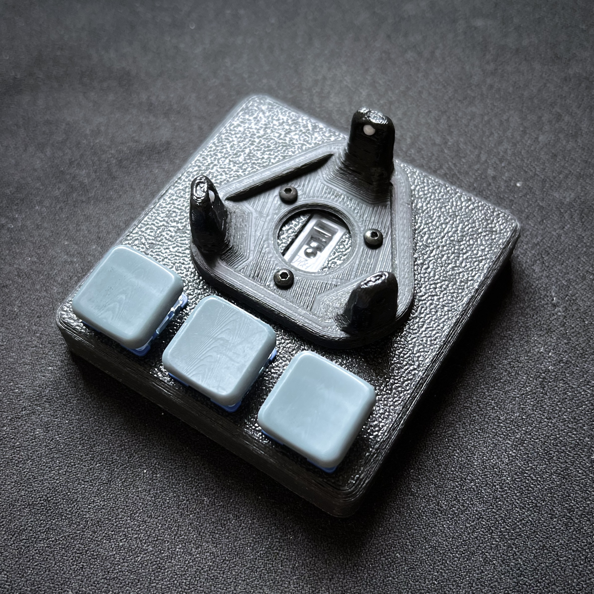
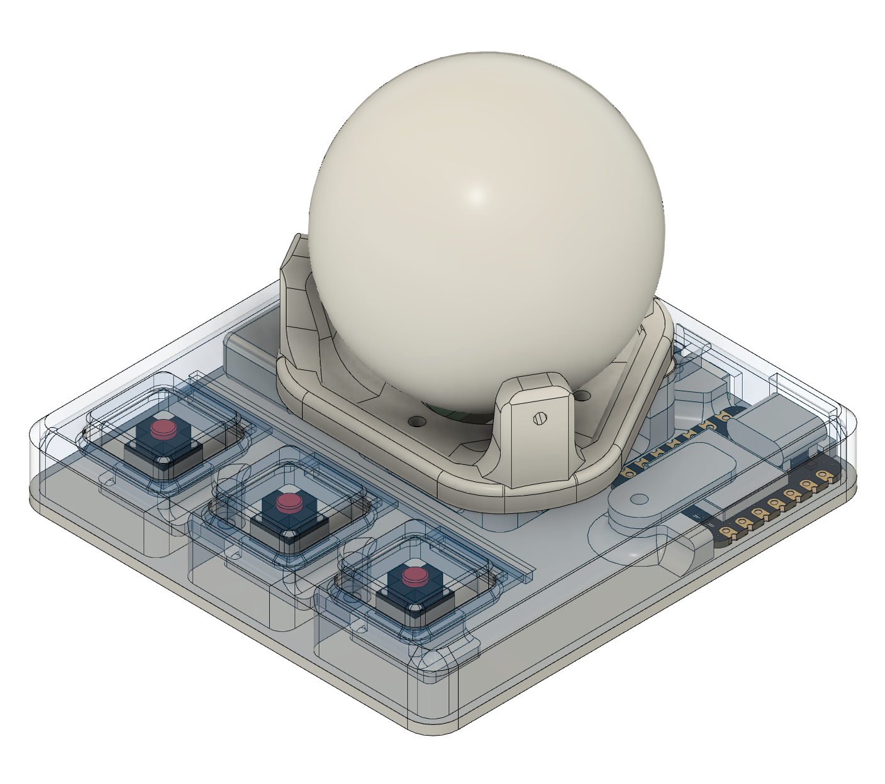
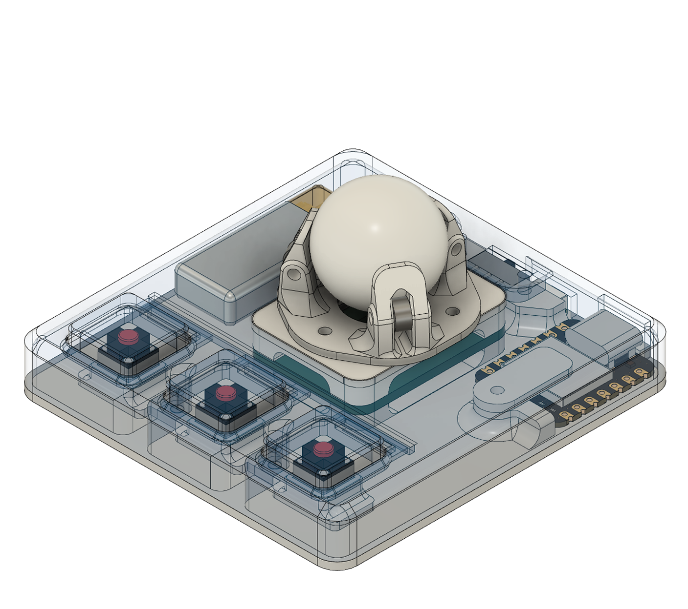

# pointabella

A pointer device peripheral test bench.

### design principles
- symmetrical
- powered by seeed studio xiao mcu
- zmk firmware
- 3 buttons
- small footpirnt, low profile
- ~~no visible screws~~ (magnetic trackball mount design in progress)

### gallery

### parts
|unit|item|
|-|-|
|1*|pixart pwm3610 optical sensor. breakout module: [badjeff](https://github.com/badjeff/pmw3610-pcb) /  [siderakb](https://github.com/siderakb/pmw3610-pcb). lens module: lm18-lsi|
|1*|pixart paw3395 optical sensor. breakout module: [badjeff](https://github.com/badjeff/paw3395-pcb). lens module: loae-lsi1|
|1*|avago adns9800 optical sensor. breakout module: [pigboard](https://oshwlab.com/pigboard/adns9800board) (See [reddit post](https://www.reddit.com/r/Trackballs/comments/ledoxb/adns_9800_board_finally_ready_project_link_in/)). lens module: adns-6190-002|
|1**|40mm, 34mm or 20mm trackball. or, pom ball from ebay/aliexpress|
|3**|static ceramic bearings; 2.5mm for 40mm and 34mm trackball mount, 2.0mm for 20mm trackball mount|
|3**|roller bearings; mr52zz（2x5x2.5mm）|
|1*|lenovo t440 trackpoint (plus 2x m1.5 screws)|
|1*|35mm cirque glidepoint circle trackpad tm035035|
|1|seeed studio xiao ble (nrf52840)|
|3|cherry mx switches. or, kailh choc v1/v2 switches (14x14mm). or, kailh cmi627301d07 6x6x7.3mm silent micro switch|
|1|msk-1153 6 pins power switch. or, 3 pins|
|1|3.5x6x2mm tact switch turtle switch (for reset button)
|1|m2 screw boxset (3-10mm)|
|1|601230 lipo battery (plus connector)|
|1|28/26 awg silicone wire|

*: choose either one;
**: for trackball mount only;

### building guide / tips

nope. easy enough.

### firmware

zmk firmware config repository can be find at [badjeff/zmk-config/tree/main/config/boards/shields/corne36](https://github.com/badjeff/zmk-config/tree/main/config/boards/shields/corne36).

### license

available under the [cern-ohl-p v2](/LICENSE) permissive license.
